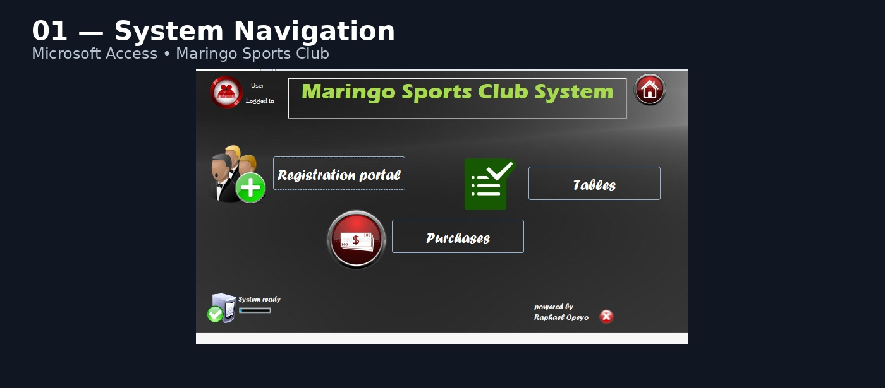
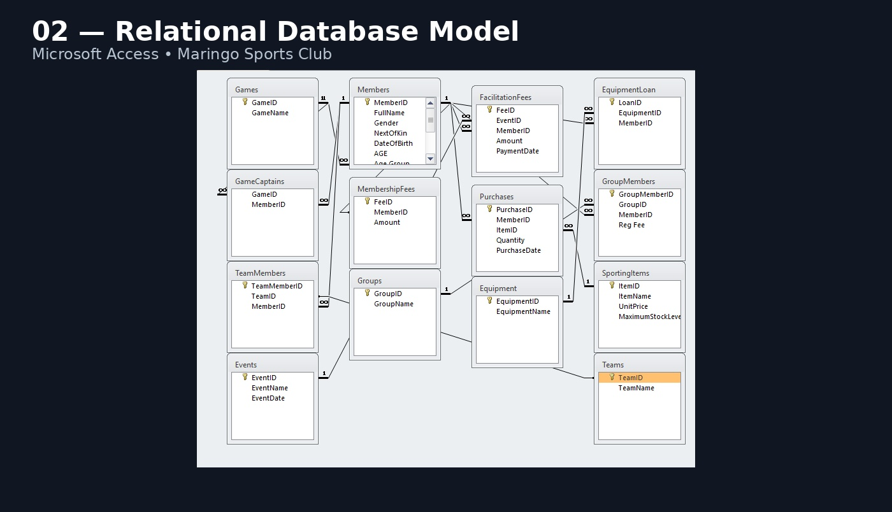
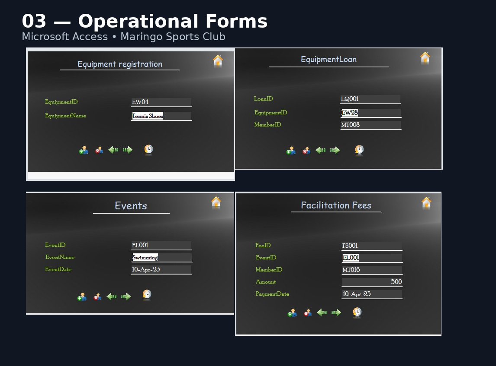
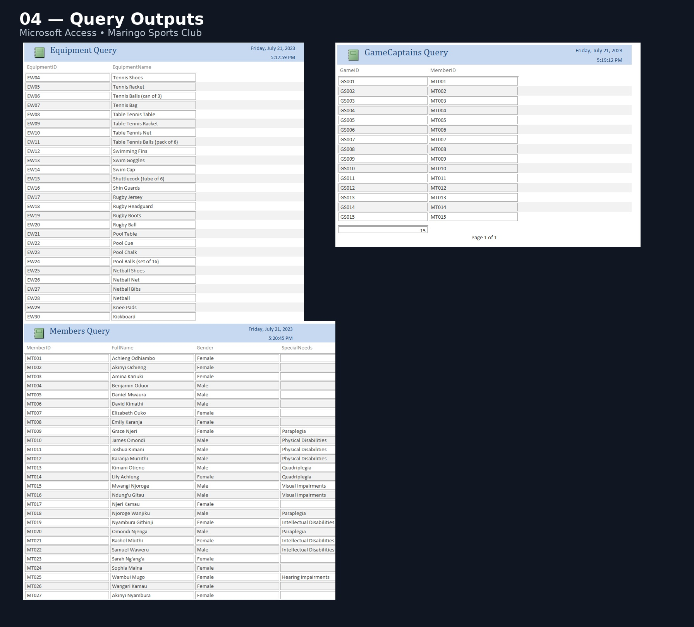
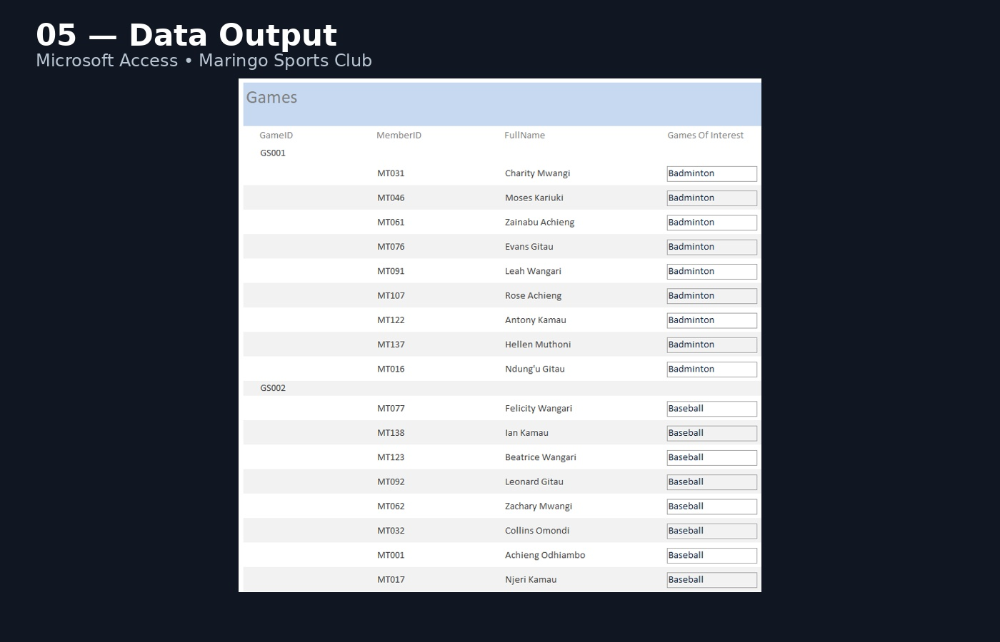

# Maringo Sports Club Management System

**Microsoft Access • Relational Database Design • Database Management • Queries • Forms • Reports**

A Microsoft Access database project demonstrating how a sports-club operation can be organized into a structured relational information system.

> **Portfolio project:** This repository is presented as a personal portfolio project for demonstrating database design and Microsoft Access skills. The Maringo Sports Club scenario and names used inside the project documentation are fictional.

## What the system demonstrates

- Member registration and member information management
- Group membership management
- Sporting-item and purchase records
- Equipment inventory management
- Equipment loan tracking
- Games and events management
- Game-captain records
- External-team facilitation records
- Membership-fee tracking
- Relational database structure and linked entities
- Saved queries for operational information retrieval
- User-facing Access forms for data entry
- Reports for structured output and management use
- Navigation/switchboard-style workflow

## Database components

The documented system includes entities such as:

- Members
- Group Members / Registration
- Membership Fees
- Equipment
- Equipment Loans
- Sporting Items
- Purchases / Sales Records
- Games
- Events / Game Schedule
- Game Captains
- Game Patrons
- External Team Facilitation
- Teams / Groups

## Technical focus

### Microsoft Access

The project demonstrates practical use of Microsoft Access as a relational database management environment, including tables, relationships, queries, forms and reports.

### Data management

The system is designed around structured records rather than manual file-based processing. Relationships connect operational entities so that information can be entered, retrieved and reported consistently.

### Queries

Example query outputs cover equipment, game-captain, game and member information.

### Forms

The interface includes dedicated forms for operational activities such as equipment registration, equipment loans, events, facilitation fees, game captains, games and group members.

### Reports

The documented system includes reports for equipment, game captains, games, members and financial/operational calculations.

## Screenshots

### System navigation



### Relational database model



### Operational forms



### Query outputs



### Data output



## Repository structure

```text
maringo-sports-club-management-system/
├── README.md
├── documentation/
│   ├── DATABASE_ARCHITECTURE.md
│   ├── FEATURES_AND_WORKFLOW.md
│   ├── QUERY_FORM_REPORT_CATALOG.md
│   └── PORTFOLIO_NOTES.md
├── screenshots/
│   ├── 01_SYSTEM_NAVIGATION_PREMIUM.jpg
│   ├── 02_RELATIONSHIP_MODEL_PREMIUM.jpg
│   ├── 03_OPERATIONAL_FORMS_PREMIUM.jpg
│   ├── 04_QUERY_OUTPUTS_PREMIUM.jpg
│   └── 05_DATA_OUTPUT_PREMIUM.jpg
└── database/
    ├── Maringo_Sports_Club_System.accdb
    └── README.md
```

## Skills demonstrated

**Microsoft Access** · **Database Management** · **Relational Database Design** · **Data Entry Systems** · **Query Design** · **Form Design** · **Report Design** · **Data Organization** · **Information Systems Analysis**

## Portfolio positioning

This project complements a broader data portfolio by adding the database layer behind reporting and analytics:

**Excel → Microsoft Access → Power BI**

That combination demonstrates capability across data preparation, structured storage, database management and business intelligence reporting.

## Author

**Brian Maobe Onyancha**  
Data Analysis • Power BI • Excel • Microsoft Access • Business Intelligence • Automation
